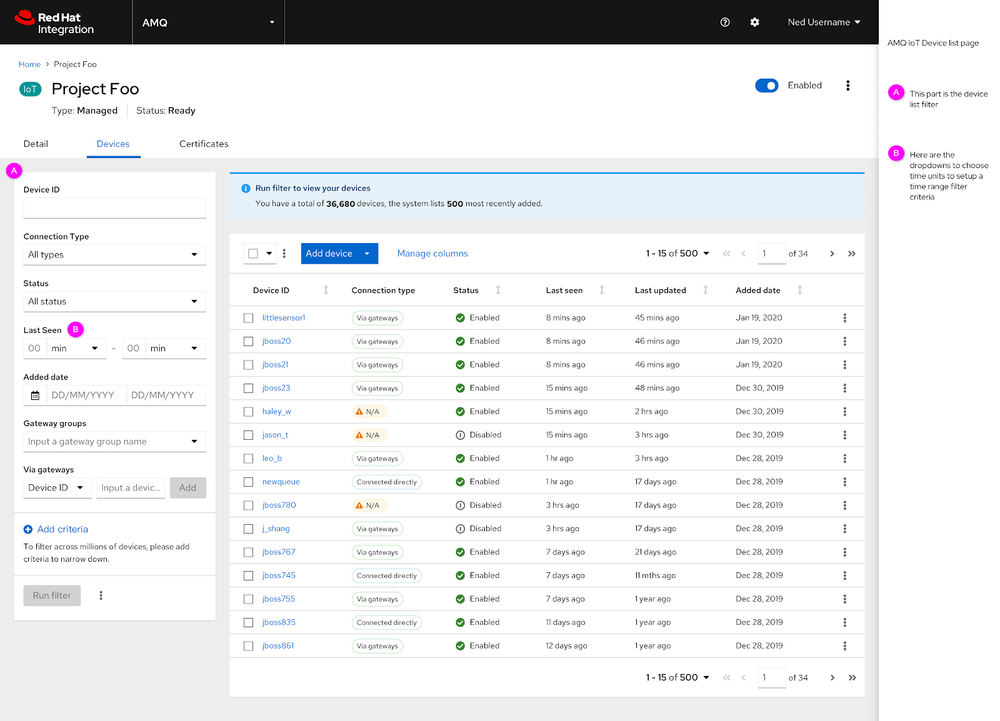
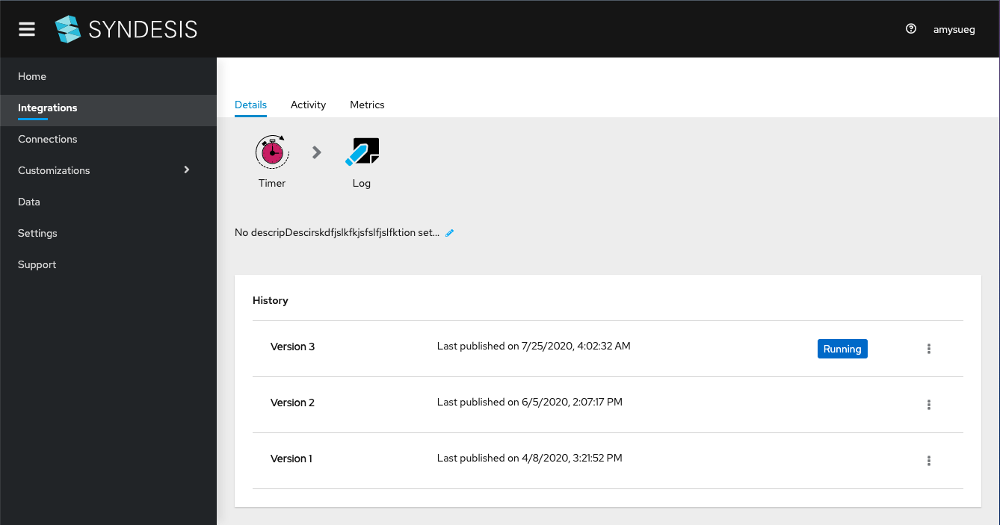
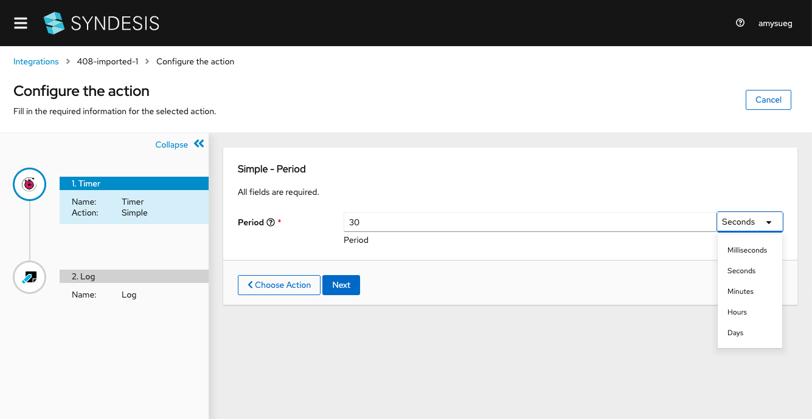

# Displaying Units of Measure
This document serves as a proposal for a standardization of the expression of units of measure in the user interfaces of Integration Services products.
The content relies heavily on existing PatternFly guidelines, international standards, and sources of best practices and guidelines of technical writing.
This work has been conducted as part of a breakaway sprint for the Integration Services UXD team, and is referenced in the App Dev UXD Jira board as backlog item [APPDUX-394](https://issues.redhat.com/browse/APPDUX-394).

## Introduction
In the Integration Services application space, the units of measure that are most likely to be displayed in the user interface are:

- Date and Time
- Data Storage
- Data Bandwidth
- Currency

Each of these are specified in the pages that follow, along with some general guidelines that apply to all units of measure.

## Fundamentals of Units of Measure
In scientific writing, metric measure is the accepted form of expression for physical and chemical quantities. 
The currently recommended system is the International System of Units (SI), which was developed by the International Committee for Weights and Measures.
The SI provides a system of measure that is constructed from seven base units, each of which is precisely defined.

| Base Quantity                | Base Unit    | Symbol |
| -------------                | ---------    | ------ |
|    length                    |   meter      |    m   |
|     mass                     |  kilogram    |    kg  |
|     time                     |   second     |    s   |
| electric current             |  ampere      |    A   |
| thermodynamic temperature    |  kelvin      |    K   |
| amount of substance          | mole         |   mol  |
| luminous intensity           | candela      |   cd   |

From the base seven units of the SI, 22 derived units have been given special names and symbols for the sake of convenience. 
All derived units are combinations of the base units (products, powers, etc.).
Additionally, there are units that are often used with SI units that are not SI units themselves. 

The common non-SI units that are accepted for use with SI units include:

+ units of time (minute = 60 s, min; hour = 3,600 s, h or hr; and day = 86,400 s, d) 
+ volume (liter = 10-3 m3, L)
+ pressure (bar = 105 Pa, bar)

## Date and Time
PatternFly provides guidance on the display of [dates and times](https://www.patternfly.org/v4/design-guidelines/content/numerics) and are summarized below, along with additional guidance.

**Date format**: use DD Month YYYY (e.g., Thursday, 01 January 2020, 07 January 2020)*

When representing the date as a numeric value or label, use [ISO Standard 8601](https://www.iso.org/iso-8601-date-and-time-format.html): YYYY-MM-DD.*

When displaying words, use the full name of the month. If space is limited, use the three-letter abbreviation of the month - Jan, Feb, Mar, Apr, May, Jun, Jul, Aug, Sep, Oct, Nov, Dec *

When displaying words, use the full name of the day of the week. If space is limited, use the three-letter abbreviation of the day of the week - Mon, Tue, Wed, Thu, Fri, Sat, Sun

\* Specified in Patternfly Design Guidelines for Numerics

**Time format**: Coordinated Universal Time (UTC) is recommended for cases where people may be collaborating across time zones (for instance, tracking incidents on a server). If using UTC, display the user’s estimated time zone as well, if possible (e.g., 14 June 2020, 02:00 am (14 June 2020, 06:00 UTC) ) *

Note: The examples used by PatternFly suggest that UTC should be primary, however the Solution Explorer scheduling UI uses local time as primary and includes UTC as a parenthetical reference.

When representing date and time, include the timestamp after the date and separate with a comma.*

**Time units**: In general, the full name of the unit of measure should be used. In cases when a symbol must be used due to space constraints or other considerations, refer to the following:

| Unit        | Symbol |
| ----------- | ------ | 
| millisecond |   ms   |
| second      |    s   | 
| minute      |   min  |
| hour        |    hr  | 

Avoid using symbols for Day, Week, Month and Year

\* Specified in Patternfly Design Guidelines for Numerics

## Data Storage
Digital information (e.g., computer storage and memory) is typically measured in bytes. Bytes can be shown in either the base 10 decimal / metric format (e.g., Gigabyte) or the base 2 / binary format (e.g., Gibibyte) scales. 

Most of the world is decimal-based, but computing is done in binary, so this scale is more accurate in representing the true amount of information. For example, a hard drive that is labelled as having a 500 gigabyte capacity is read by the binary computer system as 466 gibibytes, but is shown by most operating systems as 466 gigabytes, which has led to confusion. Binary units are becoming more frequently used in open source software. Therefore, this scale is preferable.

| Metric Unit |	Symbol | Value | Binary Unit | Symbol |	Value |
| ----------- | ------ | ----- | ----------- | ------ | ----- |
| 1 kilobyte |    KB   | 1000  |  1 kibibyte |	KiB   | 1024  |
| 1 megabyte |    MB   | 10002 |  1 mebibyte |  MiB   | 10242 |
| 1 gigabyte |    GB   | 10003 |  1 gibibyte |  GiB   | 10243 |
| 1 terabyte |    TB   | 10004 |  1 tebibyte |  TiB   | 10244 |
| 1 petabyte |    PB   | 10005 |  1 pebibyte |  PiB   | 10245 |

## Data Bandwidth
Bandwidth is measured as the amount of data that is transferred from one point to another within a computer system in a specific amount of time. 

There are two primary ways to measure data transfer:
+ Megabits/second (Mbps) - used to specify download and upload speeds on the Internet; ISPs promote their Internet speeds using this metric  
+ Megabytes/second (MBps) - used to specify the quantity of data (i.e., file size) that is transferred over time

For example, if transferring data from one system to another, connection speed displays as megabits per second (Mbps), but the data that is uploaded/downloaded is measured in megabytes per second (MBps). If using a binary scale for data size, then mebibytes/second (MiBps) is the appropriate measure of data transfer rate in this example. 

| Metric Unit | Symbol | Binary Unit | Symbol |
| ----------- | ----------- | ----------- | ----------- |
| 1 megabyte/second | MBps | 1 mebibyte/second | MiBps |
| 1 gigabyte/second | GBps | 1 gibibyte/second | GiBps |
| 1 terabyte/second | TBps | 1 tebibyte/second | TiBps |

## Currency
The display of currency should use the [ISO standard (ISO 4217)](https://www.iso.org/iso-4217-currency-codes.html) three-letter code, which is widely known and accepted.

This alphabetic code is based on another ISO standard (ISO 3166) which specifies the codes for country names. The first two letters of the ISO 4217 code are the same as the code for the country name, and, where possible, the third letter corresponds to the first letter of the currency name. 

Some cases may require the display of the ISO three-digit numeric code. This code is useful when currency codes should be understood in countries that do not use Latin scripts, as well as for computerized systems.

For example:

| Country | Currency | Alphabetic Code | Numeric Code |
| ----------- | ----------- | ----------- | ----------- |
| United States | Dollar | USD | 840 |
| China | Yuan | CNY | 156 |
| European Union | Euro | EUR | 978 |
| United Kingdom | Pound | GBP | 826 |

## General Guidelines

### Unit Names and Symbols
Whenever possible, the full name of the unit of measure should be displayed, especially for basic units of measurement (e.g., 25 pounds, 12 inches, 30 minutes). However, if there are space constraints, symbols and abbreviations can be used.

For derived units of measure — those formed using a calculation — use symbols (e.g., 38 mph, 27 ft/s2). 

Some derived units of measure have two symbols: one that represents the derivation and one that represents the word. In these cases, use the one that represents the word because it is likely to be more familiar to the user. (e.g., use Hz for Hertz instead of the derivation of cycles per second).

Unit names and unit symbols should not be mixed and mathematical operations should not be applied to unit names. For example:

|         Use 			      |      Do not use                |
| --------------------------- | -----------------------------  |
|  kg/m3	 		  | kilogram/m3         |
|  kg · m-3		  | kilogram/cubic meter           | 
|  kilogram per cubic meter   | kg/cubic meter                 | 
|                             | kilogram per meter3 |
|                             | kg per m3           | 

### Grammar and Punctuation
The symbols for SI units should be shown in lowercase, except for the units with a name derived from a proper name, in which case the first letter of the symbol is capitalized (e.g., watt is W, tesla is T, hertz is Hz).

Include a space between numbers and units (e.g.,  75 kg), but no space is included with percentages (e.g., 75%).

Unit symbols should not be altered when plural (e.g., use 60 cm and not 60 cms)

Unit symbols should not be followed by a period (unless used at the end of a sentence).

### Considerations
Be consistent when writing units of measure. For example, if presenting temperature as degrees Fahrenheit, do not suddenly switch to degrees Celsius.

If displaying a secondary unit of measure with a primary one, place it in parentheses following the primary unit of measure: 10°C (50°F).

Units for two or more related quantities must be unambiguous. If necessary, include the unit with every numeral. Avoid mixing units if possible. It is acceptable to present the unit with every numeral, as long as it is done so consistently. For example:

| Use | Do not use |
| ----------- | ----------- |
| 10 seconds to 75 seconds | 10 seconds to 1.25 minutes |
| 10 to 75 seconds |

## Examples in Integration Services Products

### AMQ Filter Last Seen Time Range

### Fuse Online Publish Date and Time  

   

### Fuse Online Timer Connection Time Units  

